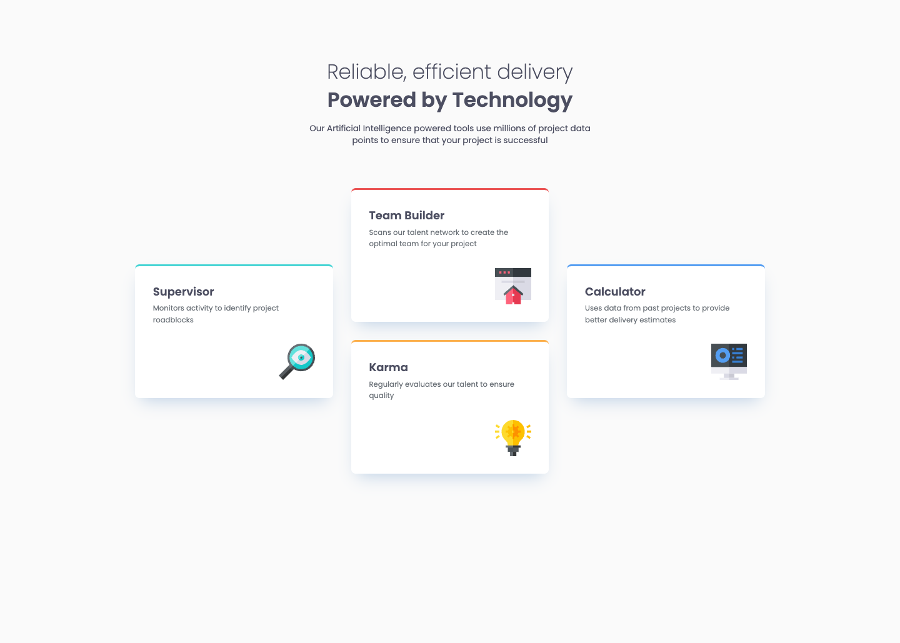
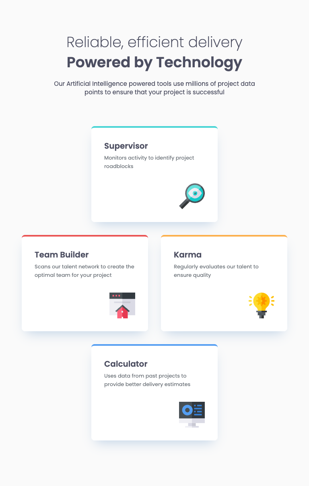
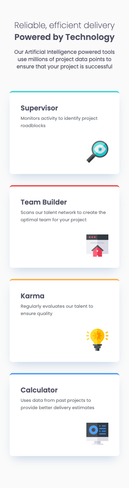

# Frontend Mentor - Four card feature section solution

This is a solution to the [Four card feature section challenge on Frontend Mentor](https://www.frontendmentor.io/challenges/four-card-feature-section-weK1eFYK). Frontend Mentor challenges help you improve your coding skills by building realistic projects. 

## Table of contents

- [Overview](#overview)
  - [The challenge](#the-challenge)
  - [Screenshot](#screenshot)
  - [Links](#links)
- [My process](#my-process)
  - [Built with](#built-with)
  - [What I learned](#what-i-learned)
  - [Continued development](#continued-development)
  - [Useful resources](#useful-resources)
- [Author](#author)

## Overview

### The challenge

Users should be able to:

- View the optimal layout for the site depending on their device's screen size

### Screenshot

#### Desktop


#### Tablet


#### Mobile


### Links

- Solution URL: [Frontend Mentor](https://www.frontendmentor.io/solutions/responsive-four-card-feature-page-using-css-grid-gsZ-XhlEYy)
- Live Site URL: [Github Page](https://iddahadev.github.io/frontend-mentor-four-card-feature-section/)

## My process

### Built with

- Semantic HTML5 markup
- CSS variables
- Flexbox
- CSS Grid & Flexbox
- Mobile-first workflow

### What I learned

I learned about the CUBE CSS methodology and tried to implement some blocks and utilities.

**Some utility examples**
```css
.shadow {
  box-shadow: 0px 15px 30px -11px rgba(131, 166, 210, 0.50);
}

.radius {
  border-radius: 0.5rem;
}
```

### Continued development

This introduction to CUBE CSS was interesting! I would like to practice more on that subject alongside BEM.

### Useful resources

- [CUBE CSS](https://cube.fyi/)
- [Picallili](https://piccalil.li/)

## Author

- Frontend Mentor - [@iddahadev](https://www.frontendmentor.io/profile/iddahadev)
